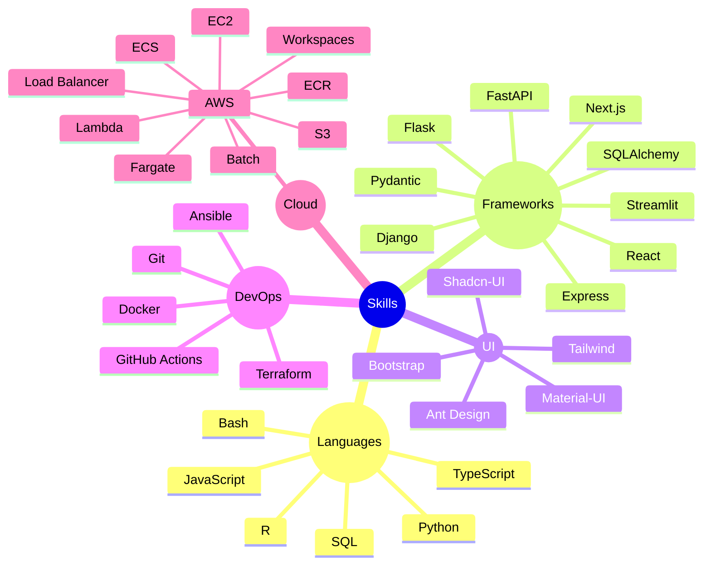

# 👋 Hi, I'm Avinash
### 💻 Full Stack Engineer

### ⚡ Tech Snapshot

### 🤝 Connect with Me  
[🌐 Portfolio]() · [💼 LinkedIn]() · [🧑‍💻 GitHub]() ·

Thanks for visiting! ✨ Let's build something awesome together.

  
  

